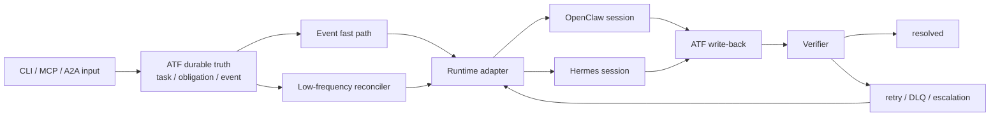

# ATF Plan

> 更新时间：2026-07-11
> 本文件是 ATF 后续实现顺序和完成标准的唯一主计划。历史 Phase A/B/C/D 文档继续作为设计与实现证据，不再代表当前优先级。

## 1. 新项目目标

ATF 的目标从“OpenClaw 上依赖 heartbeat / cron 的多 Agent 协作协议”调整为：

**面向 session 型 Agent 的、兼容 A2A 的事件优先可靠性控制面。**

首批宿主运行时：

- OpenClaw
- Hermes Agent

ATF 负责持久任务责任、事件投递、跨 session 工作恢复、回写验证和失败恢复；宿主 runtime 负责创建或恢复 session 并执行模型任务。A2A 负责跨系统互操作，ATF 不再以自建通用 Agent 通信协议为目标。

## 2. 要解决的三个核心问题

### 2.1 轮询延迟与资源浪费

任务和消息不能只等待 Agent 下次轮询发现。目标运行方式是：

- **快路径**：Task / Message / Action 写入后立即产生事件并尝试唤醒目标 Agent。
- **慢路径**：低频 reconciler 扫描漏投递、超时、失效 lease 和未回写义务。
- 空闲扫描只运行轻量进程，不唤醒 LLM。
- 同一 Agent 的短时间事件合并、去重，避免一条消息启动一个 session。

### 2.2 Session 结束后的任务遗忘

Session 只作为一次执行，不作为状态真相。ATF 必须在 session 外持久保存：

- 当前任务与 DRI
- 未读消息和待处理义务
- 上次执行结果与 verifier 结果
- 下一次触发条件
- 必须完成的 ATF write-back

每次唤醒都由 ATF 生成最小 `Work Envelope`；session 退出后由 verifier 检查回写，失败则重试、重新入队或升级。

### 2.3 A2A 与上层协作平台的替代风险

ATF 不与 A2A 竞争 `Task / Message / Artifact` 互操作标准，也不复制 AgentRQ 一类完整协作平台。ATF 保留的差异化职责是：

- DRI、SLA 和 obligation
- runtime 唤醒与 session 恢复
- 去重、lease、retry、DLQ 和 escalation
- write-back verifier
- 本地审计、恢复和运行质量指标

## 3. 目标架构

### 3.1 Runtime Adapter v1

沿用现有 launch payload 和 bridge 思路，收敛成最小 runtime-neutral contract：

- 输入：`runtime / agent / event_id / task_id / obligation_ids / context_refs / guidance / required_writebacks`
- 输出：`accepted / runtime_session_ref / dispatched_at / error`
- 必需能力：启动一次执行并返回可审计结果
- 可选能力：向活跃 session 投递、查询状态、取消执行

OpenClaw 和 Hermes 的差异必须留在 adapter 内，不能进入 task schema。

### 3.2 Work Envelope v1

Work Envelope 只包含完成本次工作所需的最小上下文：

- 唤醒原因
- 当前任务与待处理义务
- 未读消息摘要和必要引用
- 上次可靠检查结果
- 本次必须执行的 write-back
- 完成判定和 verifier 检查项

原始 session transcript 不是任务真相，也不默认整段注入。

### 3.3 Session Context Provider

共享 session 项目可作为可选的只读上下文来源：

- 允许搜索 OpenClaw、Hermes、Claude Code、Codex 等运行时的历史 session。
- 只提取与当前任务相关的摘要或引用。
- 不把跨产品 session ID 当作统一身份。
- 不用历史 transcript 替代 task、obligation、artifact 和正式 write-back。

## 4. Milestones

### M0：基线可靠性修复

目标：先让现有控制面成为可信基线。

- 修复 Agent Registry workspace 已注册但投递仍走默认路径的问题。
- JSON 采用原子写入；control-plane 增加单实例运行锁。
- 移除活跃代码未使用的生产依赖并清零相关 audit 告警。
- 修复 Phase C smoke 隔离失败，并让默认测试覆盖公开 smoke 入口。
- 增加 Node 22/24 CI。
- 修复缺失的 learnings promote 默认实现或明确改为外部可选集成。

完成标准：所有 smoke 在干净 checkout 和 CI 中通过；工作区注册路径真实生效；并发写入不会产生半截 JSON。

### M1：事件快路径与低频对账

目标：任务不再主要依赖 Agent 轮询发现。

- 为 assign、message、action、trigger 统一产生 durable event。
- 增加 per-agent debounce / dedupe。
- 现有 `sessions_spawn` bridge 适配 Runtime Adapter v1。
- control-plane 降级为低频 reconciler，保留漏投递和超时修复。

完成标准：本地事件到 adapter dispatch 的 p95 小于 5 秒；同一事件不会重复启动 session；空闲时不启动 LLM。

### M2：跨 Session Obligation 与 Verifier

目标：session 退出后任务责任不丢失。

- 定义 `atf.obligation.v1` 和 `atf.work-envelope.v1`。
- 唤醒时自动注入未完成义务和 required write-backs。
- session 结束或超时后执行确定性 verifier。
- 未回写进入 retry；耗尽后进入 `attention / escalation_required`。

完成标准：新 session 不依赖旧对话也能继续任务；缺失回写可以被自动发现并进入明确恢复状态。

### M3：Hermes Adapter Canary

目标：ATF 不再只支持 OpenClaw。

- 只使用 Hermes 官方支持的 MCP、CLI 或 gateway 接口；不直接写 Hermes 内部数据库。
- Hermes 能收到 Work Envelope 并启动一次任务执行。
- Hermes 能通过 ATF MCP/CLI 回写 ack、message、status 和 artifact reference。
- 增加 Hermes stub smoke 和一条真实 canary。

完成标准：同一个 ATF task 可以分别由 OpenClaw 和 Hermes adapter 执行，ATF 核心 task schema 无 runtime-specific 分支。

### M4：A2A Compatibility Boundary

目标：复用标准，不自建第二套外部互操作协议。

- 映射 ATF task/status 到 A2A Task。
- 映射正式输出到 A2A Artifact，交互内容映射到 Message。
- 支持 A2A push notification 进入事件快路径。
- ATF 专属 DRI、obligation、verifier 和 escalation 作为内部字段或明确 extension。

完成标准：完成一条 A2A inbound task 和一条 outbound status/artifact 的互操作 smoke。

### M5：可选 Session Context Provider

目标：利用历史 session 辅助恢复，但不引入新的状态真相。

- 先支持只读搜索和相关片段摘要。
- 优先复用现有 session 索引/MCP 项目或稳定的本地存储格式。
- 增加 provenance、长度限制和敏感信息过滤。

完成标准：跨运行时恢复实验能提高任务续接成功率；关闭该能力不影响 ATF 主链。

### M6：运行指标与去留判断

持续记录：

- 事件到 dispatch 的 p50 / p95
- 每个有效事件的 session 唤醒次数和重复率
- 未回写率、自动恢复率和升级率
- OpenClaw / Hermes 跨 session 续接成功率
- reconciler 空扫描成本

如果宿主 runtime 或 A2A 平台已经可靠覆盖某项能力，ATF 应删除重复实现或降级成 adapter / policy，而不是为保留代码继续扩张。

## 5. 明确延后

- 完整 Web 协作平台和多租户 SaaS
- 自建通用 Agent 通信标准
- 全量 session 复制或统一 transcript 数据库
- 支付、结算和开放 Agent 市场
- 在没有真实并发压力前引入 broker、分布式锁或数据库迁移

## 6. 实施顺序

严格按 `M0 -> M1 -> M2 -> M3 -> M4 -> M5 -> M6` 推进。Hermes 和 A2A 是明确目标，但不能跳过现有 OpenClaw 基线修复；共享 session 只有在 obligation/verifier 已成立后才进入主线。

## 7. 实施状态（2026-07-11）

| Milestone | 仓库实现 | 验证状态 |
| --- | --- | --- |
| M0 | registry workspace、原子 JSON、单实例锁、零生产依赖、默认全量 smoke、Node 22/24 CI、learnings promote | 完成 |
| M1 | unified durable event、250ms per-agent debounce、dedupe、event dispatcher、低频 reconciler、Runtime Adapter v1 | 完成；本地 p95 smoke < 5s |
| M2 | `atf.obligation.v1`、`atf.work-envelope.v1`、required write-back、verifier、retry 与 escalation | 完成 |
| M3 | OpenClaw adapter、Hermes 官方 `POST /v1/runs` adapter、stub/HTTP contract canary | 仓库完成；真实 Hermes endpoint canary 待部署环境 |
| M4 | A2A inbound Task/Message、outbound status/artifact、push notification、ATF extension metadata | 完成 |
| M5 | 可关闭的只读 session context、provenance、长度限制、secret redaction | 完成；真实续接提升率待生产实验 |
| M6 | dispatch p50/p95、wake/duplicate、write-back/recovery/escalation、runtime 分组指标 | 完成；长期基线待生产采样 |

仓库完成标准由 `npm test` 和 `npm audit --omit=dev` 验证。真实 Hermes canary 与生产效果指标属于部署验证，不用本地 stub 冒充。
